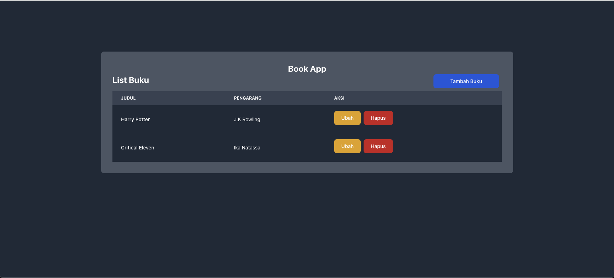
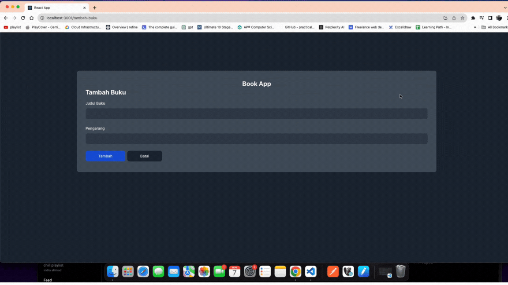
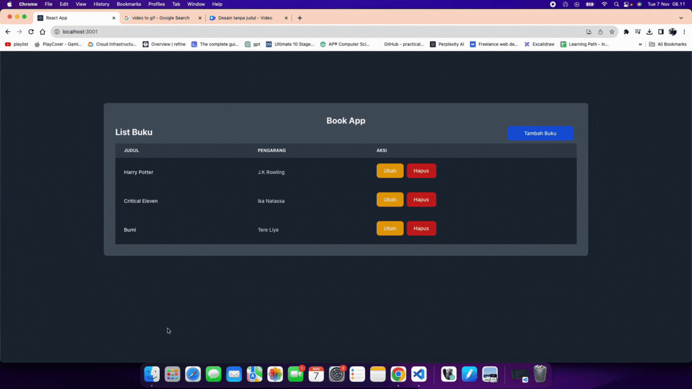
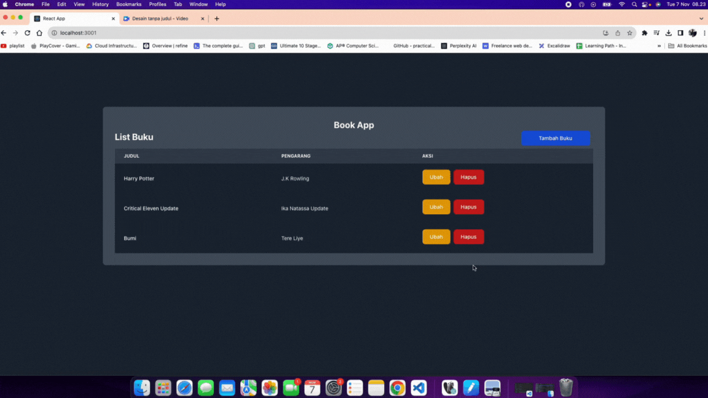

# Release-2

## CRUD in local state

Pada Release ini, kalian akan memfungsikan Create, Read, Update, dan Delete (CRUD) pada aplikasi Book App, mengunakan Local State (useState)

### Keterangan:
1. Total Halaman pada aplikasi ada 3 halaman, yaitu
    - path `/` dengan komponen `src/pages/Home.jsx`
    - path `/tambah-buku` dengan komponen `src/pages/AddBookPage.jsx`
    - path `/edit-buku/:id` denga komponen `src/pages/EditBookPage.jsx`
Kalian harus menambahkan konfigurasi untuk halaman-halaman diatas pada `App.js`
2. Komponen untuk rendering list, terdapat pada komponen `src/pages/components/BookTable.jsx`
3. Gunakan hooks `useState` untuk data `books`

### Ekspektasi Output Program
1. **READ:** Rendering List pada halaman home, dengan data dari state
    
contoh data:
```js
  const [books, setBooks] = useState([
    {
      id: 1,
      title: 'Harry Potter',
      author: 'J.K Rowling'
    },
    {
      id: 2,
      title: 'Critical Eleven',
      author: 'Ika Natassa'
    }
  ])
```


Referensi: 
- Rendering List of Data: https://sugared-charger-815.notion.site/Materi-Rendering-Lists-37820e8d6cc14137b4150cbdea8cdc84
- useState: https://react.dev/reference/react/useState

2. **CREATE:** Menambahkan data dari halaman `/tambah-buku`
    - Fungsikan button `Tambah Buku` pada halaman `/` untuk mengarahkan ke halaman `/tambah-buku`
    - Data tersebut ditambahkan ke state
    - Lakukan navigasi menggunakan `useNavigate` ke halaman `/` setelah selesai menambahkan data
    - Validasi form kosong menggunakan `alert`
    - Fungsikan button `Batalkan` yang menavigasikan ke halaman `/`



Referensi:
    - Menambahkan data ke list of array: https://react.dev/learn/updating-arrays-in-state#adding-to-an-array
    - useNavigate: https://reactrouter.com/en/main/hooks/use-navigate

3. **UPDATE:** Mengubah data dari halaman `/edit-buku/:id`
    - Fungsikan button `Edit` pada komponen `src/components/BookTable.jsx` untuk mengarahkan ke halaman `/edit-buku/:id`
    - Data tersebut mengubah ke state
    - Lakukan navigasi menggunakan `useNavigate` ke halaman `/` setelah selesai mengubah data
    - Validasi form kosong menggunakan `alert`
    - penjelasan mengenai id dari `/edit-buku/:id` adalah params, silahkan baca referensi dibawah, untuk mengambil value, gunakan hooks `useParams` dari react router dom
    - Update buku harus disesuaikan dengan params yang tersimpan pada path
    - Fungsikan button `Batalkan` yang menavigasikan ke halaman `/`



Referensi: 
    - Mengubah data pada list of array: https://react.dev/learn/updating-arrays-in-state#replacing-items-in-an-array
    - useParams: https://reactrouter.com/en/main/hooks/use-params

4. **DELETE:** Menghapus data dari halaman `/`
    - Fungsikan button `Hapus` pada komponen `src/components/BookTable.jsx` untuk menghapus item dari array
    - Data tersebut menghapus dari state




Referensi: 
    - Menghapus data pada list of array: https://react.dev/learn/updating-arrays-in-state#removing-from-an-array
